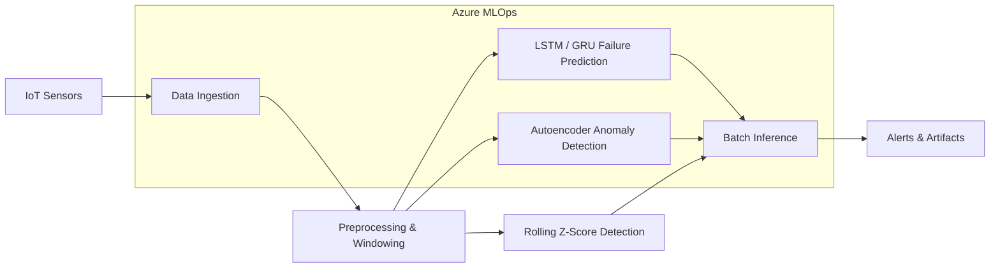

# Predictive Maintenance for IoT Sensor Data

End-to-end machine learning portfolio project for **predicting equipment failures** and **detecting anomalies** from multivariate IoT sensor time-series (temperature, vibration, pressure). Built with **LSTM/GRU deep learning**, **autoencoder anomaly detection**, and an **Azure MLOps** deployment pipeline.

---

## Highlights (Resume-Ready)

- Developed **LSTM and GRU** deep learning models to predict equipment failures using multivariate IoT sensor time-series.
- Implemented **anomaly detection** using autoencoders and rolling-window statistical techniques.
- Built an **Azure-based MLOps pipeline** for automated data ingestion, model training, versioning, and scheduled batch inference.

---

## Architecture



---

## Project Structure

```
├── config/config.yaml          # Hyperparameters and Azure settings
├── src/
│   ├── data/                   # Synthetic data generation & preprocessing
│   ├── models/                 # LSTM, GRU, autoencoder architectures
│   ├── anomaly/                # Rolling-window & AE anomaly detectors
│   └── utils/                  # Evaluation metrics
├── pipelines/
│   ├── local_train.py          # End-to-end local training
│   ├── local_inference.py      # Batch inference
│   └── azure/                  # Azure ML pipeline & environment
├── notebooks/                  # Exploratory analysis
├── tests/                      # Unit tests
├── scripts/
│   ├── setup_venv.sh           # Create & install venv
│   └── activate.sh             # Auto-activate venv
└── Makefile                    # One-command workflows
```

---

## Quick Start

### 1. Auto-setup virtual environment

The project auto-activates `.venv` when you open it in **Cursor/VS Code** (see `.vscode/settings.json`).

```bash
# One-time setup (creates .venv + installs dependencies)
make setup

# Or manually:
bash scripts/setup_venv.sh
source scripts/activate.sh
```

### 2. Train models locally

```bash
make train
# Equivalent to:
# python pipelines/local_train.py --model all
```

This will:
1. Generate synthetic IoT sensor data (50 machines × 2000 readings)
2. Preprocess into sliding windows
3. Train LSTM and GRU failure predictors
4. Train an autoencoder for anomaly detection
5. Run rolling-window statistical anomaly detection
6. Save models to `models/` and metrics to `artifacts/`

### 3. Run batch inference

```bash
make infer
```

### 4. Run tests

```bash
make test
```

### 5. Launch Jupyter notebook

```bash
make notebook
```

---

## Models

| Model | Purpose | Input | Output |
|-------|---------|-------|--------|
| **LSTM** | Failure prediction | 50-step sensor window | Failure probability |
| **GRU** | Failure prediction | 50-step sensor window | Failure probability |
| **Autoencoder** | Anomaly detection | Sensor vector | Reconstruction error |
| **Rolling Z-Score** | Statistical anomaly | Per-sensor time series | Binary anomaly flag |

---

## Azure MLOps Deployment

1. Copy environment template:
   ```bash
   cp .env.example .env
   # Fill in AZURE_SUBSCRIPTION_ID
   ```

2. Log in to Azure:
   ```bash
   az login
   ```

3. Submit the training + inference pipeline:
   ```bash
   make pipeline
   ```

The Azure pipeline (`pipelines/azure/train_pipeline.py`) orchestrates:
- **Data ingestion** from registered datasets
- **Model training** with versioned artifacts
- **Scheduled batch inference** for production scoring

---

## Tech Stack

- **Python 3.11** · TensorFlow/Keras · scikit-learn · pandas · NumPy
- **Azure ML SDK v2** · Azure Identity
- **Jupyter** · pytest · YAML configuration

---

## Configuration

Edit `config/config.yaml` to tune:
- Window size, forecast horizon, train/val/test splits
- LSTM/GRU architecture (units, dropout, epochs)
- Autoencoder encoding dimension and anomaly threshold percentile
- Rolling-window z-score parameters
- Azure workspace and compute cluster names

---

## Author

**Postgraduate in Data Science** — Portfolio project demonstrating time-series ML, deep learning, and cloud MLOps for industrial IoT predictive maintenance.

---

## License

MIT
